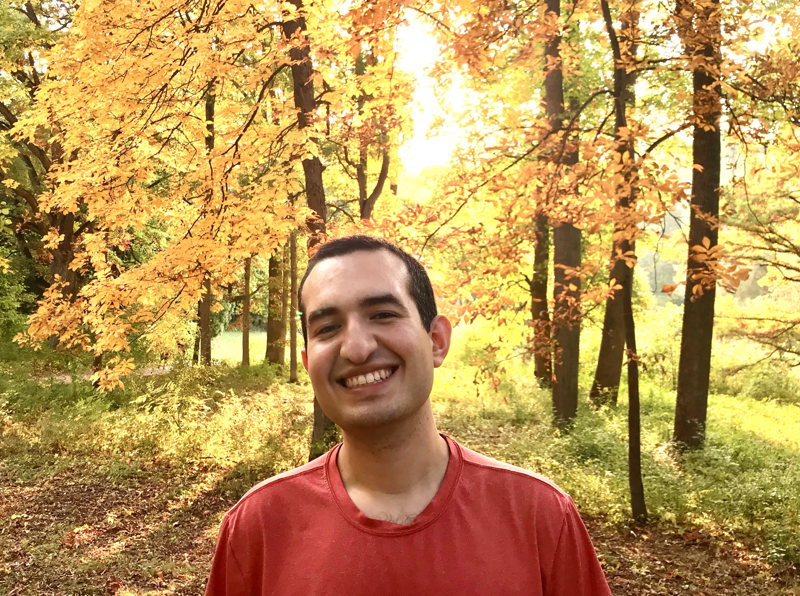

    

Hi, I'm Ismael! I'm a Postdoc at the [Astronomy Department](https://www.astro.umd.edu/) in the University of Maryland as of Fall 2025. 

I am broadly interested in applying statistical methods to data from large cosmological surveys. I
am an active member of the LSST [Dark Energy Science Collaboration](https://lsstdesc.org/).

This is my personal academic website, here you can find information about my current projects,
publications, and more:

- [My Projects](/projects/)
- [My Publications](/publications/)
- [My Talks](/talks/)
- [CV](https://raw.githubusercontent.com/ismael-mendoza/CV/main/cv.pdf)

## Contact and personal links

- **Email**: <ismael@umd.edu>

- **ORCID**: <https://orcid.org/0000-0002-6313-4597>
