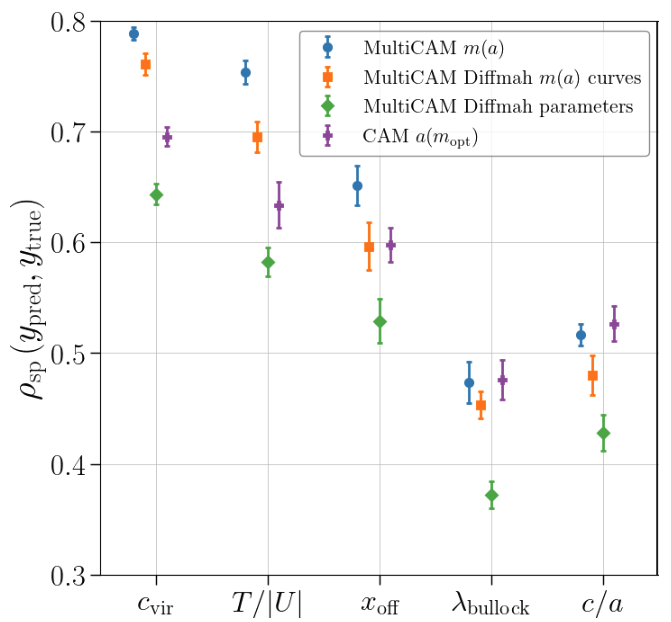

You can find details about what I'm currently working on here below.

## Statistcal framework for Galaxy-Halo Connection on N-body Simulations

- I developed [MultiCAM](https://github.com/ismael-mendoza/multicam), a multi-variable extension to conditional abundance matching (CAM) that can be used to connect properties
of dark matter haloes with properties of galaxies.

    

*Above is a demonstration of the correlation strength between predictions of MultiCAM and CAM, where MultiCAM use the full mass accretion history (MAH) of a dark matter halo as features for prediction.*

## Machine Learning models for mitigating the galaxy-galaxy blending problem in cosmology

- I developed [BLISS](https://github.com/prob-ml/bliss) a machine learning model for probablistic inference of galaxy properties in blended galaxy fields.

## Framework for evaluating galaxy deblending algorithms

- I developed [BTK](https://github.com/LSSTDESC/BlendingToolKit) a software tool for simulating galaxy blends and consistent comparing galaxy deblenders based onv various metrics.
